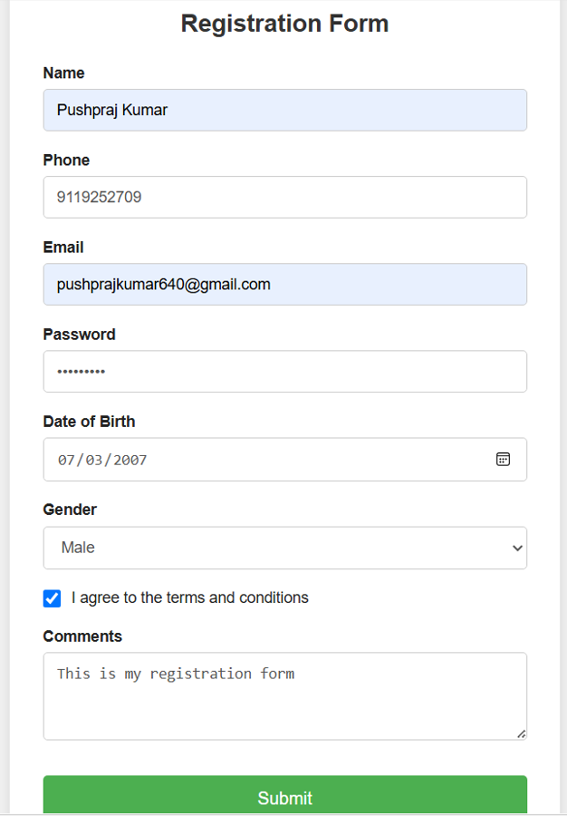

# 📋 Registration Form

A simple and responsive Registration Form built using HTML, CSS, and JavaScript.

---

## 🚀 Features

- User Registration Form
- Responsive Design
- Input Validation
- Clean and Modern UI
- Easy to Use

---

## 📸 Screenshot



---

## 🌐 Live Demo

🚀 [Open Registration Form](https://pushprajkumar640-lang.github.io/registration-form/)
---

## 📁 Project Structure

```
Registration-Form/
│── index.html
│── style.css
│── script.js
│── screenshot.png
└── README.md
```

---

## ▶️ How to Run

1. Download or clone the repository.
2. Open the project folder.
3. Double-click **index.html**.
4. Start using the Registration Form.

---

## 👨‍💻 Author

**Pushpraj Kumar**

GitHub: https://github.com/pushprajkumar640-lang
